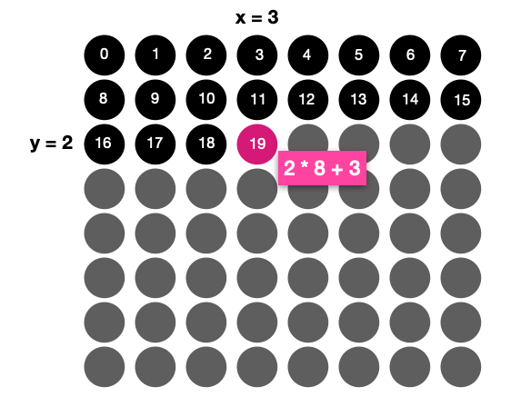

# Homework 1: One-Block Tetris

In this homework, you will develop your first MicroPython program for the [Raspberry Pi Pico](https://www.raspberrypi.com/products/raspberry-pi-pico) (**RPI**) board – a simplified version of the popular game [TETRIS](https://en.wikipedia.org/wiki/Tetris). The main difference is that there is only one type of block – a single pixel.

The objective of this homework is to let you **familiarize yourself with the MicroPython/Raspberry Pi Pico developing environment**, as well as understand **non-blocking scheduling**.

<p align="center">

</p>

## Content of this folder

- _src_: source folder with your python code (_main.py_).
- _SubmissionForm_: [this](SubmissionForm.md) form contains your data and **must** be submitted with every homework or project.
- _demo_: a folder that contains the working example of the game you have to make. Simply upload the _main.py_ file on your RPI for testing it.
- _images_: a folder with some images for this document.
- _README_: this file, containing the instructions.

## Getting started

In terms of hardware you need a _RPI_, the [BlinkPico shield](https://github.com/ID220/BlinkPico) and a breadboard to complete the assignment. This tutorial assumes you will use the [Thonny](https://thonny.org) editor.

1. Download or clone this repository on your computer. Extract the folder from the zip file if necessary.
2. Make sure your _RPI_ is plugged into your computer via USB and connected to Thonny - the shell should show the prompt `>>>`.
3. Install the BlinkPico shield [library](https://github.com/ID220/BlinkPico/blob/main/library/README.md). To do so go to `Tools -> Manage packages` and search for `BlinkPico`. Install the package.
   

### How to test the demo

1. Open the _main.py_ file in the demo folder using Thonny.
2. Right-click on the file shown on the left sidebar and click on `Upload to /` (where _/_ means the root folder on _RPI_).
3. Restart the _RPI_.

## Homework instructions

### Code requirments

- The BlinkPico is an 8x8 matrix. Blocks always start at position [0,3] and move downward, 1 row at a time every _200ms_. If there is an obstacle underneath, the block stops there.
- You can use the _left_ (A) and _right_ (B) buttons to move the current block. The system checks for a user input every _100ms_.
- Blocks cannot move to locations that are already occupied.
- If blocks form a _full row_, the row is deleted.
- If one column of blocks reaches the top (i.e., all rows are occupied), it is _game over and a SAD face_ appears.
- You can use the _C_ button to restart the game.

### Tips

- Consider using a list to keep track of the state (on/off) of each one of the 64 pixels. You do not need to use multi-dimensional lists (e.g., a 2x2 list). Instead, you could use (but it is up to you) a single 1D list with 25 items. If you want to address a specific point (x, y) you can use the following formula: ` indexInList = y*COLS + x`, where COLS is the number of columns (in this case 8). Here is an example, if you want to access the point (3,2), you need to address the 19th LED (the 19th element of your list).

<p align="center">

</p>

- The brightness of the built-in LEDs is between 0 (off) and 100 (fully on). In my demo, I used the brightness of 50 but you can change it.
- If you need to change the values assigned to global variables of immutable types (e.g., numbers and booleans) remember to use the keyword `global`. Here an example

```python
x = 0

# Wrong: this will not work!
def changeX (newX):
    # newX is assigned to a new local variable x
    x = newX;

# Correct
def changeX (newX):
    global x
    # x is a reference to the global x
    x= newX;
```

## Submission and grading

Zip your MicroPython sketch (_zip_, not ALZIP, rar, or others) and submit this file using the [homework submission system](https://homework.prototyping.id).

<p align="center">

</p>

Your zip file must include:

1. _SubmissionForm.md_ filled up with your information (`10% of your score`).
2. A _main.py_ with your code. You can also include any additional file you want, but _main.py_ should be there and should be named exactly _main.py_ (`90% of the score`).

Please note that:

1. Only submissions made with the system will be considered (no direct emails to TA or Prof).
2. You can re-submit as many times as you want before the deadline &ndash; we will consider your last submission.
3. Submissions within 24 hours after the deadline are accepted but penalized **20%**. Submissions after 24 hours are **not considered** (score will be 0).
4. If the file is too large (>20 MB) the system won’t allow the submission. Remove from the zip file unnecessary files.
5. Do not copy from the Internet or colleagues without attribution. Remember the _honor code policy_.
6. The instructor reserves the right of assigning, at his discretion, a bonus or penalty of up to 10% (e.g., qualitative assesment of the code or of the prototype).
